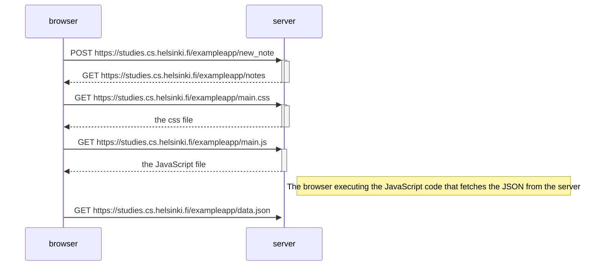

```mermaid
sequenceDiagram
   participant browser
   participant server

   browser->>+server: POST https://studies.cs.helsinki.fi/exampleapp/new_note
   activate server
   server-->>-browser: GET https://studies.cs.helsinki.fi/exampleapp/notes
   deactivate server

   browser->>+server: GET https://studies.cs.helsinki.fi/exampleapp/main.css
   activate server
   server-->>-browser: the css file
   deactivate server
  
   browser->>+server: GET https://studies.cs.helsinki.fi/exampleapp/main.js
   server-->>-browser: the JavaScript file

  Note right of server: The browser executing the JavaScript code that fetches the JSON from the server


   browser->>+server: GET https://studies.cs.helsinki.fi/exampleapp/data.json


```
